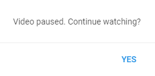

# What is this?
When you leave the video playing in the background, YouTube pauses the video after a while and asks you to click the button to continue playing:

Userscript keeps track of when this pop-up appears, and as soon as it appears, immediately clicks on it and continues playing the video, so you won’t even notice that the video has been paused.

# How to install?
* Just install any UserScript manager extension for your browser, e.g. [Tampermonkey](https://www.tampermonkey.net/) (Supports many modern borwsers)
* After installing extension, just go [here](https://github.com/syleront/youtube-non-stop/raw/master/index.user.js), and extension automatically prompts you to install script. Or you can manually add contents of index.user.js in your UserScript manager.
* And nothing else, it just works!

P.S. The script was tested on LoFi Hip-Hop radio translation, and in 12 hours the video was never paused.
